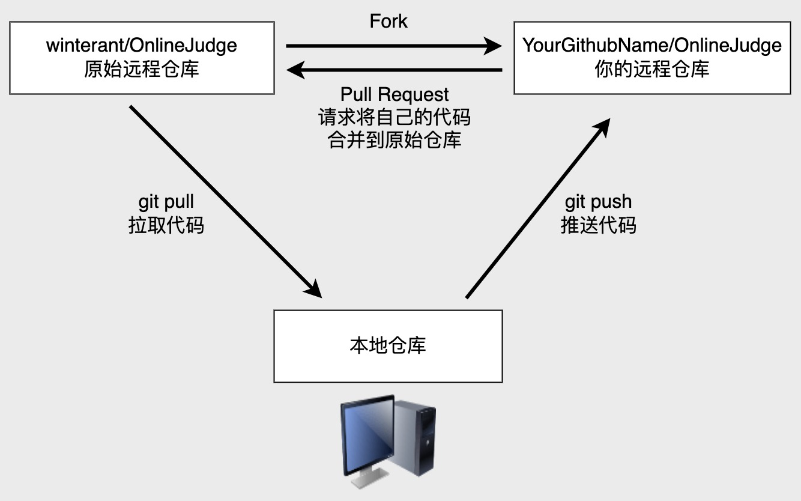

# 开发手册

> 开发应尽最大可能地遵循[前后端接口规范 - RESTful版](https://github.com/winterant/restful-api-specification)。

## 生产环境

<!--  -->

生产环境采用`docker-compose`编排方式部署，包含4个镜像，分别是
- `winterant/lduoj`; 基于Ubuntu22.04镜像构建[Web端](https://github.com/winterant/OnlineJudge)；
- `winterant/go-judge`; 基于[go-judge](https://github.com/criyle/go-judge)构建判题端；
- `mysql:8.0`; 官方镜像；
- `redis:7.0`; 官方镜像；

部署方式请参考[安装](../deploy/deploy.md)。

## 本地开发

>开发前，你需要对[Laravel框架](https://learnku.com/docs/laravel/10.x)有一些基本的了解。  
>本地开发最简单的方法是按照生产环境的部署方式部署到本地电脑，并将源码映射到宿主机，在本地打开源码目录进行开发即可。

### 一. 个人电脑需要安装的软件

#### 1. 代码编辑器或IDE（任选一个）

- [vscode](https://code.visualstudio.com)（推荐）；  
  vscode是一个编辑器，你需要安装一些必备的插件才能进行开发：
     - Chinese (Simplified)(简体中文)（可选；汉化vscode主界面）
     - PHP Intelephense（必需；php语法提示工具）
     - Laravel Blade Snippets（必需；前端模板提示工具）
     - Laravel Blade formatter（必需；前端模板格式化工具）
     - Git History（可选；可视化查看文件修改历史）
- [PhpStorm](https://www.jetbrains.com/phpstorm/)；

#### 2. docker

安装docker请参考[安装-准备工作](../deploy/deploy.md)。

#### 3. git
如需向远程仓库贡献代码，请安装[git](https://git-scm.com/)。附[git基础操作笔记](https://blog.csdn.net/winter2121/article/details/124227331)。

注意：现在github口令验证变严格了，从本地向远程仓库推送代码，只能通过ssh方式，所以你需要参考[git基础操作笔记](https://blog.csdn.net/winter2121/article/details/124227331)配置好github access ssh key。


### 二. 将项目部署到本地

#### 1. 获取最新部署脚本（全部版本详见[releases](https://github.com/winterant/OnlineJudge/releases)）；
```bash
# 1. 创建项目文件夹并进入
mkdir OnlineJudge
cd OnlineJudge
# 2. 下载部署脚本和配置文件, 注意-O是大写字母O.
curl -O https://gitee.com/winant/OnlineJudge/raw/master/install/docker-compose.yml
curl -O https://gitee.com/winant/OnlineJudge/raw/master/install/lduoj.conf
```
下文所有开发操作都将发生在文件夹`OnlineJudge`内，所以建议你把它放在一个你熟悉的位置（Windows用户不要放在C盘）。

#### 2. 修改必要的配置  
`docker-compose.yml`：
```yml
# 其它代码...

services:
  web:
    # 其它代码...
    volumes:
      # - ./data/web/storage:/app/storage  # **必须注释掉**
      - ./data/web:/app  # **必须启用**，将源码将挂载到宿主机`./data/web/`

# 其它代码...
```

`lduoj.conf`：
```shell
APP_DEBUG=true    # **强烈建议**，启用laravel框架的debug模式
```

#### 3. 启动容器；在宿主机文件夹`OnlineJudge/`下执行。稍等几分钟，docker会自动下载好镜像并启动容器。
```bash
sudo docker compose up -d
```
打开浏览器访问<http://localhost:8080>，如果成功显示首页，则表示本地开发环境部署成功。


### 三. 网页端开发与维护

#### 1. 使用vscode打开文件夹`OnlineJudge/data/web/`，即可看到Web端源码。

#### 2. 配置git仓库；

配置两个远程仓库：
- `origin`，原始远程仓库，人人拥有pull权限，但只有[winterant](https://github.com/winterant)拥有`push`权限；
- `forked`，你从[github原始仓库](https://github.com/winterant/OnlineJudge)网页上fork出来的远程仓库。  
```bash
git init  # 初始化仓库，将创建默认分支main
git remote add origin git@github.com:winterant/OnlineJudge.git  # 添加原始远程仓库，用于pull获取最新代码
git remote add forked git@github.com:<GithubUser>/OnlineJudge.git  # 添加个人远程仓库，用于push改动的代码
```
解释：
`origin`、`forked`仅仅是在本地的别名，你可以随便起名字，远程仓库不会得知它们。
在实际使用时，
- 你完全可以从`forked`源`pull`和`push`自己的远程仓库，而不配置`origin`；
- 如果你拥有原始仓库的`push`权限，则无需`forked`仓库，只配置一个`origin`就可以了；

<div align="center">

</div>

#### 3. 从github获取最新代码；
```bash
git fetch --all  # 拉取远程代码，但不合并到本地仓库
git reset --hard origin/master # 将origin/master分支远程代码覆盖本地、暂存区、工作区当前本地分支(main)
git branch --set-upstream-to=origin/master main  # 设置origin/master作为本地分支main的获取源
```

#### 4. 开始愉快地开发吧！

<div align="center">
  
</div>

- （可选）默认情况下，laravel框架的开发依赖包没有被安装在`winterant/lduoj`镜像内。
大多数情况下，不使用它们也不会影响开发。你可以在`composer.json`的`require-dev`部分看到这些仅用于开发的依赖包。
如果你是资深开发者或对此项目有长期开发计划，那么非常建议你手动安装这些依赖：
```bash
docker exec -it ludoj-web composer install --ignore-platform-reqs --dev
```

- （可选）开发过程中，若配置（如`routes/web.php`,`config/*.php`等）修改后不生效，可手动取消缓存：
```bash
docker exec -it lduoj-web php artisan opimize:clear  # 清空容器内配置的缓存
```

#### 5. 开发完某个功能后，你需要提交(commit)你的代码（注意这仅仅是提交到本地仓库，不代表提交到远程仓库）；
你可以使用vscode自带的代码管理器来提交，也可以使用以下命令进行提交：
```bash
git add .  # .代表当前项目目录全部添加到暂存区等候提交，你也可以替换成你希望提交的那部分文件
git commit -m "committing information."
```

#### 6. 向远程仓库推送代码；将本地的改动推送到你的远程仓库：
```bash
git pull  # 先将远程代码合并到本地，若有冲突则解决冲突之后再push
git push --set-upstream forked main:master  # 本地main分支推送到forked远程仓库master分支
```

然后在你的远程仓库中，向原始仓库发起Pull Request，并联系[winterant](https://github.com/winterant)审阅、合并代码。
