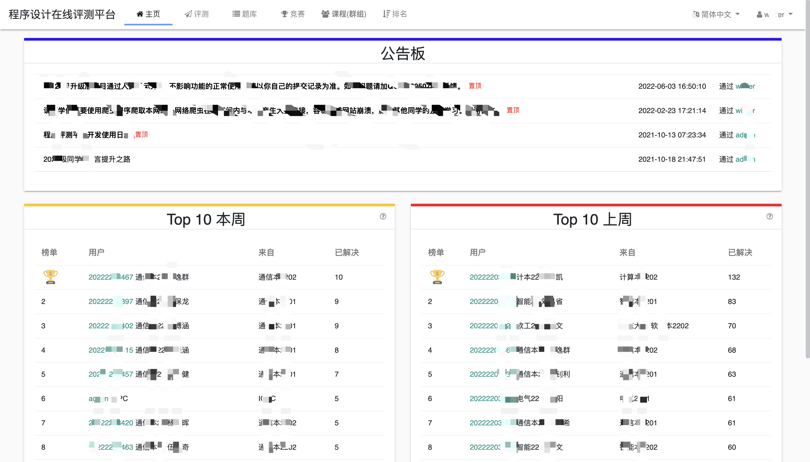
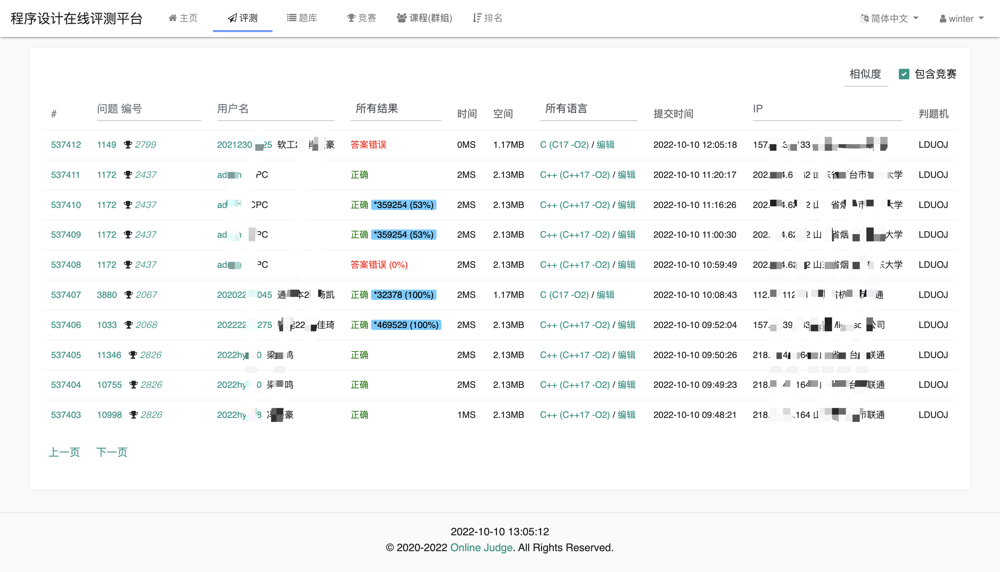
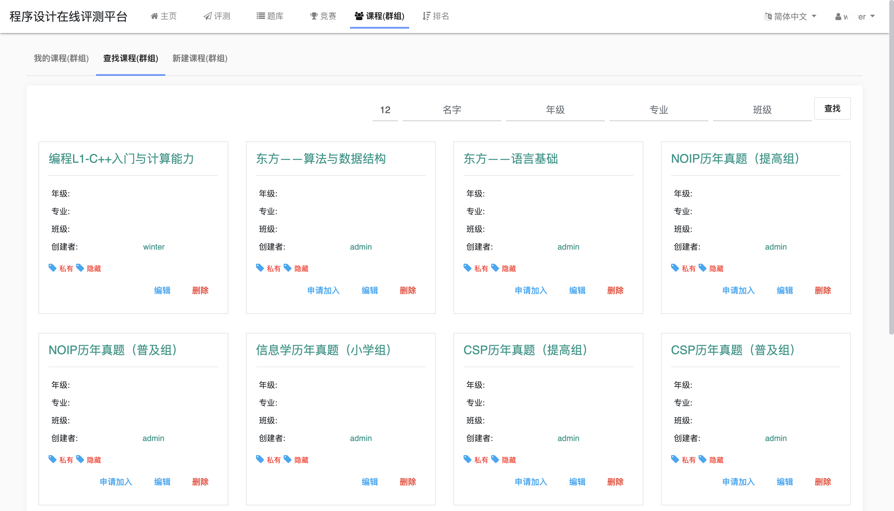
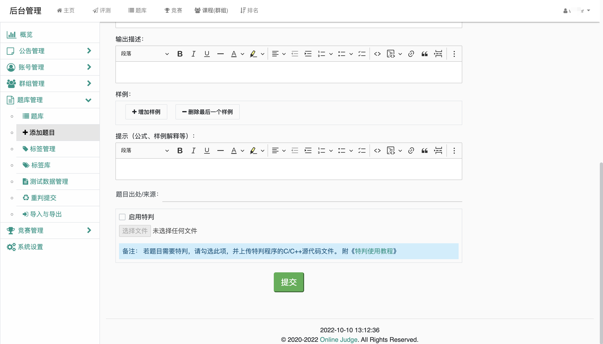
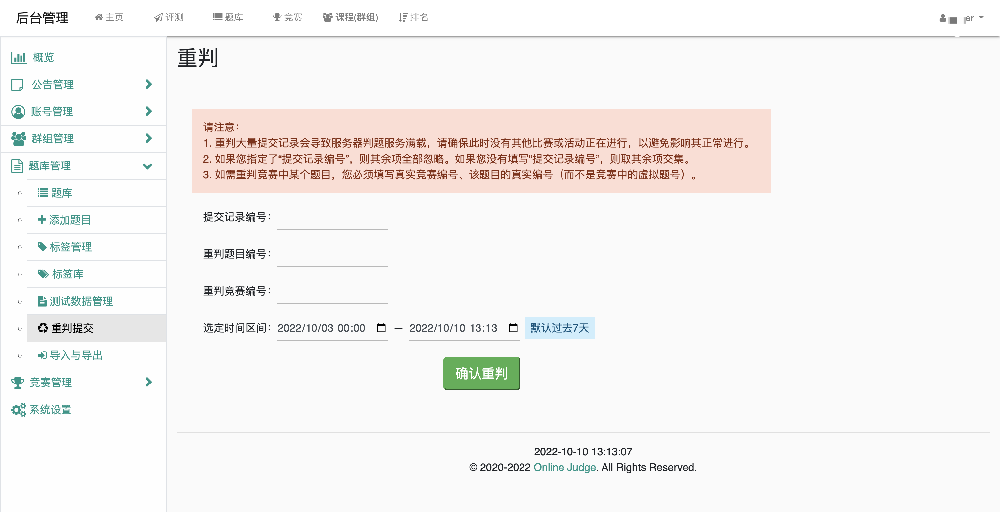
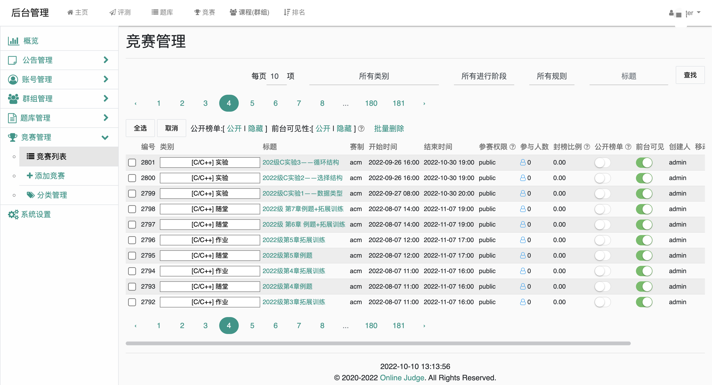
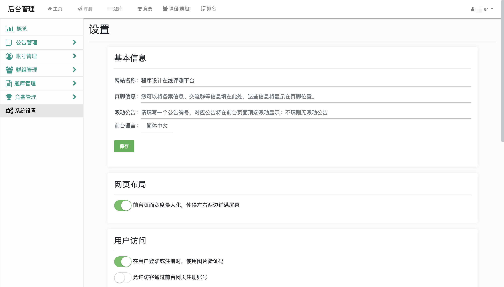

# 快速了解

>Ludong University Online Judge  
鲁东大学程序设计在线测评系统与考试平台  
官方网站：[https://icpc.ldu.edu.cn](http://icpc.ldu.edu.cn)

## 💻 前台

+ 首页；公告/新闻，本周榜，上周榜；
+ 状态；用户提交记录与判题结果；
+ 问题；题库（支持编程题、代码填空题）；
+ 竞赛；题目(选自题库)，排名(ACM,OI)可封榜，**赛后补题榜**，公告栏，气球派送；
+ **群组**；按课程或班级组织用户，批量开设竞赛；
+ 排名；用户解题排行榜。

## ⌨️ 后台

+ 公告新闻；用户访问首页可见；
+ 用户管理；账号权限分配，批量生成账号，黑名单；
+ 题目管理；增改查，公开/隐藏，重判结果，导入与导出(兼容hustoj)；
+ 竞赛管理；增删查改，公开/隐藏；
+ 系统配置；修改网站名称，打开/关闭一些全局功能，中英文切换，系统在线升级等。

## 🏞 截屏展示

- 网站首页

- 评测

- 题库

- 竞赛

- 群组

- 全站排名

- 后台管理

- 用户管理

- 题目管理

- 添加/编辑题目

- 重判提交记录

- 竞赛列表

- 添加/编辑竞赛

- 竞赛类别管理

- 全站全局设置

