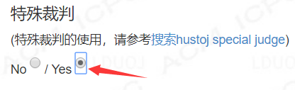

# 特判方法

## 情景描述

程序设计题有时答案不唯一，因此需要编写一个特判程序，对用户输出的答案进行鉴别，是否符合题意。special judge以下简称spj。下面用案例说明spj使用方法，出题人只需要修改judge函数。

>下面的spj编写方法同时适用于hustoj，具体方法见文末。

## 案例

### 1. 问题输出描述

输出包含一个小数，要求用户输出的答案与标准答案的误差不得超过​0.000001。

### 2. 编写spj.cpp

【出题人须知】

- 请在`jduge`函数中编写特判逻辑，评测错误`return WA;`，正确则`return AC;`，不要修改judge函数之外的任何代码。
- 请使用jscanf()读取数据，用法与fscanf相同，见代码。
- 请使用标准输出（`printf`或`cout`）向参赛选手展示必要的提示信息，该信息将在代码详情页面显示。也可以不输出任何东西，则参赛选手不会看到任何提示信息。

```cpp
#include<bits/stdc++.h>
using namespace std;
 
#define AC 0
#define WA 1
 
void jscanf(FILE *&fin, const char *format, ...) {
    va_list args;
    va_start(args, format);   /* 初始化变长参数列表 */
    int ret = vfscanf(fin, format, args);
    va_end(args);         /* 结束使用变长参数列表 */
    if (ret == EOF) {
        printf("When reading data, the program crashes because EOF is encountered in advance.\n");
        exit(WA);
    }
}
 
bool is_whitespace(const char c) {
    return c == ' ' || c == '\t' || c == '\n' || c == '\r';
}
 
//检查用户是否存在多余输出
int read_until_eof(FILE *&fp) {
    char ch = fgetc(fp);
    while (ch != EOF && is_whitespace(ch)) {
        ch = fgetc(fp);
    }
    if (ch != EOF) {
        printf("There is redundant content in user output\n");
        return WA;
    }
    return AC;
}
 
int judge(FILE *&std_in, FILE *&std_out, FILE *&user_out);
 
int main(int argc, char *args[]) {
    if (argc <= 1) {
        printf("Please enter the path of input file, output file, and contestant output file in turn:\n");
        for (int i = 1; i <= 3; i++) {
            args[i] = new char[100];
            scanf("%s", args[i]);
        }
    }
    FILE *in = fopen(args[1], "r");   //测试输入
    FILE *out = fopen(args[2], "r");  //测试输出
    FILE *user = fopen(args[3], "r"); //用户输出
    if (in == NULL)
        printf("No such a file with path %s\n", args[1]);
    if (out == NULL)
        printf("No such a file with path %s\n", args[2]);
    if (user == NULL)
        printf("No such a file with path %s\n", args[3]);
 
    int result = AC;
    if (!in || !out ||!user)
        result = WA;
 
    if (judge(in, out, user) != AC || read_until_eof(user) != AC)
        result = WA;
 
    fclose(in);
    fclose(out);
    fclose(user);
    return result;
}
/*************************** 以上内容请勿修改！！！ ***********************/
 
 
/*************************** 请在下面的jduge函数体内编写特判逻辑！ ***********************/
int judge(FILE *&std_in, FILE *&std_out, FILE *&user_out) {
    /**
     * std_in: 标准输入文件
     * std_out: 标准输出文件
     * user_out: 用户输出文件
     * 1. 请务必使用jscanf(FILE*, char*, ...)函数读取数据，用法与fscanf()相同
     * 2. 你可以使用标准输出（printf或cout）向参赛选手展示错误原因
     *
     * 以下部分是特判程序，需要出题人根据题意去判断用户的答案是否正确。
     */
    double i, a, b;
    //jscanf(std_in, "%lf", &i); //由于该案例的特判不使用输入数据，故无需从std_in读取数据
    jscanf(std_out, "%lf", &a);//读取标准答案
    jscanf(user_out, "%lf", &b);//读取参赛选手输出的答案
    if (fabs(a - b) > 1e-6) {
        printf("Your result is beyond the scope of the answer! \n");
        printf("The absolute difference between your result and the standard answer is %.9f\n", fabs(a - b));
        return WA;
    }
    printf("Yes\n"); //这句可以不写，仅提示选手通过了一组测试数据
    return AC;
}
```

### 3. 启用特判

在添加/修改题目时，选中“启用特判”，并上传你编写好的`cpp`文件。


## 附录

### 本地测试
直接运行spj.cpp，然后分别输入三个文件的（相对/绝对）路径：【测试输入】、【测试输出】、【参赛选手输出】。


### HUSTOJ使用方法

1. 在题目编辑页面设置`spj`为`Yes`；



2. 将编写好的`cpp`文件自行上传到测试数据对应题号文件夹下（默认`/home/judge/data/题号/`）；
3. 在终端编译`cpp`文件；
```bash
cd /home/judge/data/题号/
g++ spj.cpp -o spj
chmod +x spj
```